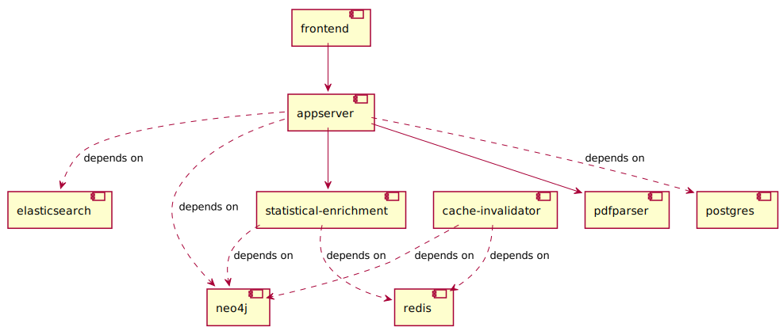

Most recent version of the code has been moved to: https://github.com/biosustain/lifelike

#  Lifelike

 &nbsp;&nbsp;&nbsp;&nbsp;&nbsp;&nbsp;
 &nbsp;&nbsp;&nbsp;&nbsp;&nbsp;&nbsp;


Lifelike is an open-source project that aims to provide a simple, yet powerful platform for turning structured and unstructured data from a variety of sources into a single, coherent and explorable knowledge graph.

[](https://zenodo.org/badge/latestdoi/437040913)

## Quick start

The easiest way to get started and run a fully functional development environment of Lifelike is to clone this repository and run the `make up` command:

```shell
git clone https://github.com/SBRG/lifelike.git
cd lifelike

make up
```

This will take a few minutes to complete, after which you can start using Lifelike by pointing your browser to [http://localhost:8080](http://localhost:8080).

You can log in using the default admin user `admin@example.com` and password `password`.

## Other installation methods

You can see more details about how to deploy lifelike in a production environment,
or customize the development installation in the following sections.

1. [Docker with Docker Compose](docker)
2. [Kubernetes with Helm chart](helm/lifelike)

## Lifelike main concepts

### Projects

Lifelike organizes content into projects. A project is a filesystem-like collection of resources either uploaded by users or generated by Lifelike based on other resources. Those resources can be all kinds of data, including structured data like spreadsheets, unstructured data like PDF files, images, or text documents.

### Knowledge Domains

Lifelike structures knowledge around domains. A domain is a collection of semantically related entities belonging to a field of study.

### Annotations

Annotations are a powerful way to attach context to your data in knowledge Domains, Lifelike automatically annotates all your data with Domain known entities as well as lets you define your own custom annotations.

### Knowledge Graph

Domain data sources are annotated and stored in a graph database. A knowledge graph consists of nodes and edges. Nodes are domain entities and edges are relations between entities.

### Visualizations

Visualizations are a powerful way to help you to understand the relationships between entities as well as a powerful tool to find new relationships as new data comes in.

Lifelike currently provides the following built-in visualization types:

- Maps
- Enrichment tables
- Sankey diagrams
- Pathway Browser

### Other features

- Multi-user collaborative workbench
- Powerful search engine

## Common development operations

You can run `make help` to see a list of available commands.

```text
$ make help

usage: make [target]

development:
  githooks                        Set up Git commit hooks for linting and code formatting

docker:
  up                              Build and run container(s) for development. [c=<names>]
  images                          Build container(s) for distribution.
  status                          Show container(s) status. [c=<names>]
  logs                            Show container(s) logs. [c=<names>]
  restart                         Restart container(s). [c=<names>]
  stop                            Stop containers(s). [c=<names>]
  exec                            Execute a command inside a container. [c=<name>, cmd=<command>]
  test                            Execute test suite
  down                            Destroy all containers and volumes
  reset                           Destroy and recreate all containers and volumes
  diagram                         Generate an architecture diagram from the Docker Compose files

helm:
  helm-lint                       Run helm lint on Lifelike chart
  helm-dependency-update          Install or update chart dependencies
  helm-schema-gen                 Generate Helm chart values JSON schema
  helm-docs                       Generate Helm chart README docs
  helm-package                    Generate Lifelike helm chart package
  helm-install                    Install or upgrade Lifelike chart
  helm-install-single-node        Install or upgrade Lifelike chart using the single-node example values

other:
  help                            Show this help.
```

## Architecture

Lifelike is a distributed system comprised of the following components:



### Core services

- **[Appserver](appserver)**. Backend API service, written in Python using the the Flask framework.
- **[Client](client)**. Frontend Single Page Application, written in Typescript using the Angular framework.
- **[Statistical enrichment](statistical-enrichment)**. Statistics generation microservice, written in Python using the the Flask framework.
- **[Cache invalidator](cache-invalidator)**. Recurrent task runner for bulk large computations and cache data management, written in Python.
- **[Graph data migrator](graph-db)**. Utility service for migrating and versioning knowledge graph database, using the Liquibase database migration tool.

### Backing services

- **PostgreSQL** as a RDBMS.
- **Neo4j** as a graph database.
- **Elasticsearch** as a full-text search engine.
- **Redis** as a key-value cache store.
- **PDFParser** as a document parsing library.
- **Sendgrid** as an email messaging service.

## License

Lifelike is distributed under a [modified MIT license](LICENSE).


