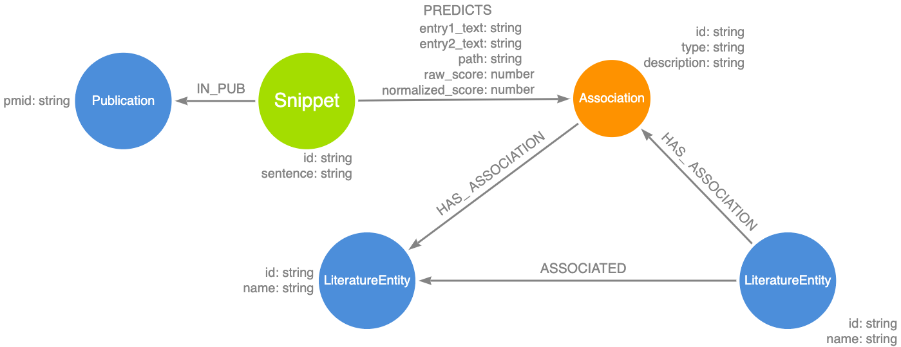

# LL-2193 Refactor literature data so that snippet is unique

In the new schema, properties entry path, entry1_text and entry2_text moved from node Association to relationships PREDICTS.



#### add association id:
  ``` 
drop index on :Association(id);
 call apoc.periodic.iterate(
 "match (n1)-[:HAS_ASSOCIATION]->(a:Association)-[:HAS_ASSOCIATION]->(n2) return n1, a, n2", 
 "set a.id = n1.id + '-' + n2.id + '-' + a.type",
 {batchSize:10000, parallel: true}
 );
CREATE CONSTRAINT constraint_association_id ON (n:Association) ASSERT n.id IS UNIQUE;
  ```
#### set snippet id
``` 
drop index on :Snippet(id);
call apoc.periodic.iterate(
"match (n:Snippet)-[:IN_PUB]-(p) return n, p",
"set n.id = p.pmid + '-' + n.sentence_num", 
{batchSize:10000, parallel: true}
)
```

#### Set PREDICTS properties:
``` 
call apoc.periodic.iterate(
"match (n:Snippet)-[p:PREDICTS]-(a) return n, p",
"set p.entry1_text = n.entry1_text, p.entry2_text = n.entry2_text, p.path = n.path",
{batchSize:5000, parallel: true}
)
```
#### Remove Snippet properties:
``` 
call apoc.periodic.iterate("match (n:Snippet) return n",
"remove n.path, n.pmid, n.entry1_text, n.entry1_type, n.entry2_text, n.entry2_type, n.sentence_num",
{batchSize:5000, parallel: true}
)
```
#### Merge Snippets:
updated 2929405, 2hrs
``` 
CALL apoc.periodic.commit("
match (n:Snippet) with n.id as id, collect(n) as nodes where size(nodes) > 1 with nodes limit $limit
call apoc.refactor.mergeNodes(nodes, {properties: 'discard', mergeRels:true}) yield node
RETURN COUNT(*)
",{limit:5000}
) 
```
## remove redudent [IN_PUB]
```
call apoc.periodic.commit("
 match(s:Snippet)-[r:IN_PUB]-(p) with s, p limit $limit set s.pmid = p.pmid return count(*)   
", {limit:10000});

match(n:Snippet) with n match (p:Publication {pmid:n.pmid}) create (n)-[:IN_PUB]->(p);
```

## Merge Synonym nodes
``` 
CALL apoc.periodic.commit("
match (n:Synonym) with n.name as name, collect(n) as nodes where size(nodes) > 1 with nodes limit $limit
call apoc.refactor.mergeNodes(nodes, {properties: {name:'discard',`.*`: 'discard'}}) yield node
RETURN COUNT(*)
",{limit:10000}
);

drop index on :Synonym(name);

create constraint constraint_synonym_name on (n:Synonym) assert n.name is unique;
```

## Additional fix
Add entry1_type and entry2_type in association nodes
```
call apoc.periodic.iterate(
    "match(n:db_Literature:Association)-[:HAS_TYPE]-(t) where not t.name in ['B', 'J'] with n, apoc.text.split(t.direction, '-')  as entryTypes return n, entryTypes[0] as entry1_type, entryTypes[1] as entry2_type",
    "set n.entry1_type = entry1_type, n.entry2_type = entry2_type",
    {batchSize: 10000}
)
```
Association type B has relationships for chemical-gene or gene-gene;   
```
call apoc.periodic.iterate(
"match(t:AssociationType {name:'B'})-[:HAS_TYPE]-(n) with n, apoc.text.split(n.id, '-') as ids 
with n, case
when ids[0] starts with 'CHEBI' then 'chemical'
when ids[0] starts with 'MESH' then 'chemical'
else 'gene' end as entry1_type
return n, entry1_type, 'gene' as entry2_type",
"set n.entry1_type = entry1_type, n.entry2_type = entry2_type",
{batchSize:10000}
)
```

Association type J has relationships for chemical-disease or gene-disease
```
call apoc.periodic.iterate(
"match(t:AssociationType {name:'J'})-[:HAS_TYPE]-(n) with n, apoc.text.split(n.id, '-') as ids 
with n, case
when ids[0] starts with 'CHEBI' then 'chemical'
when ids[0] starts with 'MESH' then 'chemical'
else 'disease' end as entry1_type
return n, entry1_type, 'gene' as entry2_type",
"set n.entry1_type = entry1_type, n.entry2_type = entry2_type",
{batchSize:10000}
)
```

### Change relationship PREDICTS to INDICATES
```
call apoc.periodic.iterate(
"match(n:Snippet)-[r:PREDICTS]->(n2) return n, n2, r",
"create (n)-[r2:INDICATES]->(n2) 
set r2.entry1_text = r.entry1_text, r2.entry2_text=r.entry2_text, 
r2.path=r.path, r2.raw_score=r.raw_score, r2.normalized_score=r.normalized_score",
{batchSize:5000}
);

call apoc.periodic.iterate(
    "match(n:Snippet)-[r:PREDICTS]->() return r",
    "delete r",
    {batchSize: 5000}
);

```
