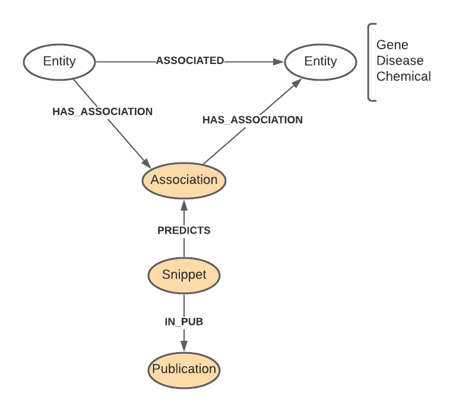

# LL-3049 Refactoring literature nodes to create LiteratureEntity nodes based on GraphAware suggestion

Old model: 
Entity is either NCBI Gene, MESH Disease or CHEBI Chemical/MESH Chemical

 

New model:
New entity nodes created with id and name properties.  all entity nodes were labeled as literatureentity and db_literature.  
- gene -> LiteratureGene  
- Disease -> LiteratureDisease  
- Chemical -> LiteratureChemical  


### 1. Craete Liaterature Disease
- Create constraint
```
create constraint constraint_literaturedisease_id on (n:LiteratureDisease) assert n.id is unique
```

- Create nodes
```
match(n:Disease:db_Literature) 
merge(x:LiteratureDisease {id:n.id}) set x:db_Literature, x:LiteratureEntity, x.name = n.name
merge (x)-[:MAPPED_TO]->(n);
match(n:Disease) where (n)-[:ASSOCIATED]-() and not 'db_Literature' in labels(n) 
merge (x:LiteratureDisease {id:n.id}) set x:db_Literature, x:LiteratureEntity, x.name = n.name
merge (x)-[:MAPPED_TO]->(n)
```

### 2. Create Literature Chemical
- Create constraint
```
create constraint constraint_literaturechemical_id on (x:LiteratureChemical) assert n.id is unique
```

- Create nodes
```
match(n:Chemical:db_Literature) 
merge(x:LiteratureChemical {id:n.id}) set x:db_Literature, x:LiteratureEntity, x.name = n.name
merge (x)-[:MAPPED_TO]->(n);
match(n:Chemical) where (n)-[:ASSOCIATED]-() and not 'db_Literature' in labels(n) 
merge (x:LiteratureChemical {id:n.id}) set x:db_Literature, x:LiteratureEntity, x.name = n.name
merge (x)-[:MAPPED_TO]->(n)
```

- clean-up
Both mapped_to and map_to relationships in mesh terms. 
```
match(x:db_MESH)-[r:MAPPED_TO]->(y) where (x)-[:MAP_TO]->(y) delete r;
match(x:db_MESH)-[r:MAPPED_TO]->(y) merge (x)-[:MAP_TO]->(y) delete r;
```

### 3. Create Literature Gene
- Create constraint
```
create constraint constraint_literaturegene_id on (n:LiteratureGene) assert n.id is unique
```

- Create nodes
```
match(n:db_Literature:Gene) 
merge(x:LiteratureGene {id:n.id}) set x:db_Literature, x:LiteratureEntity, x.name = n.name
merge (x)-[:MAPPED_TO]->(n);
```

### 4. Create Disease - Association
```
call apoc.periodic.iterate(
    "match(n:LiteratureDisease)-[:MAPPED_TO]-(d:Disease)<-[:HAS_ASSOCIATION]-(a) return n, a",
    "merge(a)-[:HAS_ASSOCIATION]->(n)",
    {batchSize:5000}
)
```

```
call apoc.periodic.iterate(
    "match(n:LiteratureDisease)-[:MAPPED_TO]-(d:Disease)-[:HAS_ASSOCIATION]->(a) return n, a",
    "merge(n)-[:HAS_ASSOCIATION]->(a)",
    {batchSize:5000}
)
```   

remove old disease-association relationship
```
match(n:Disease)-[r:HAS_ASSOCIATION]-(a) delete r
```

### 5. Create Chemical-Association

if use parallel=true for iteration, seemed to inserted more relationships

```
call apoc.periodic.iterate(
    "match(n:LiteratureChemical)-[:MAPPED_TO]-(d:Chemical)<-[:HAS_ASSOCIATION]-(a) return n, a",
    "merge(a)-[:HAS_ASSOCIATION]->(n)",
    {batchSize:5000}
)
```

```
call apoc.periodic.iterate(
    "match(n:LiteratureChemical)-[:MAPPED_TO]-(d:Chemical)-[:HAS_ASSOCIATION]->(a) return n, a",
    "merge(n)-[:HAS_ASSOCIATION]->(a)",
    {batchSize:5000}
)
```
    
Remove old associations    
```
call apoc.periodic.iterate(
    "match(n:Chemical)-[r:HAS_ASSOCIATION]-() return r",
    "delete r",
    {batchSize: 5000}
)
```

### 6. Create Gene-Association
```
call apoc.periodic.iterate(
    "match(n:LiteratureGene)-[:MAPPED_TO]-(d:Gene)<-[:HAS_ASSOCIATION]-(a) return n, a",
    "merge(a)-[:HAS_ASSOCIATION]->(n)",
    {batchSize:5000}
)
```

```
call apoc.periodic.iterate(
    "match(n:LiteratureGene)-[:MAPPED_TO]-(d:Gene)-[:HAS_ASSOCIATION]->(a) return n, a",
    "merge(n)-[:HAS_ASSOCIATION]->(a)",
    {batchSize:5000}
)
```

Delete old associations
```
call apoc.periodic.iterate(
    "match(n:db_Literature:Gene)-[r:HAS_ASSOCIATION]-() return r",
    "delete r",
    {batchSize: 5000}
)
```

There is one gene that had association but not labeled as db_literature (MYC). Create Literature gene for it
```
match(n:Gene) where (n)-[:HAS_ASSOCIATION]-() 
merge (x:LiteratureGene {id:n.id}) set x:db_Literature, x:LiteratureEntity, x.name = n.name
merge (x)-[:MAPPED_TO]->(n)
```

Add the missed associations:
```
match(n:LiteratureGene)-[:MAPPED_TO]-(g:Gene) where not (g:db_Literature) 
with n, g match (g)-[:HAS_ASSOCIATION]->(a) 
merge (n)-[:HAS_ASSOCIATION]->(a);

match(n:LiteratureGene)-[:MAPPED_TO]-(g:Gene) where not (g:db_Literature) 
with n, g match (g)<-[:HAS_ASSOCIATION]-(a) 
merge (a)-[:HAS_ASSOCIATION]->(n);
```

Delete the old asociations that has an entity without db_literature label
```
match(n:LiteratureGene)-[:MAPPED_TO]-(g:Gene) where not (g:db_Literature) 
with g match (g)-[r:HAS_ASSOCIATION]-(a) delete r
```

### 7. Create Entity-Entity Associations
```
call apoc.periodic.iterate(
"match(x:LiteratureEntity)-[:HAS_ASSOCIATION]->(a)-[:HAS_ASSOCIATION]->(y:LiteratureEntity) return x, y, a",
"create (x)-[r:ASSOCIATED]->(y) set r.type = a.type, r.description = a.description",
{batchSize:5000}
)
```
query created 3637053 associated relationships. There should be 3637074 relationships.  Need to check why ....

### 8. Remove old entity-entity associations

call apoc.periodic.iterate(
"match (n:LiteratureEntity)-[:ASSOCIATED]->(n2)-[:MAPPED_TO]-(y) with n, n2, y 
 match (n)-[:MAPPED_TO]-(x)-[r:ASSOCIATED]->(y) return r",
"delete r",
{batchSize:5000}
)

### 9. Remove old db_Literature labels for Gene, Disease and Chemical

```
match(n:db_Literature:Chemical) remove n:db_Literature;
match(n:db_Literature:Disease) remove n:db_Literature;
match(n:db_Literature:Gene) remove n:db_Literature;
```


## Literature data structure
- db_Literature
    - LiteratureEntity
        - LiteratureGene
        - LiteratureDisease
        - LiteratureChemical
    - Snippet
    - Association

