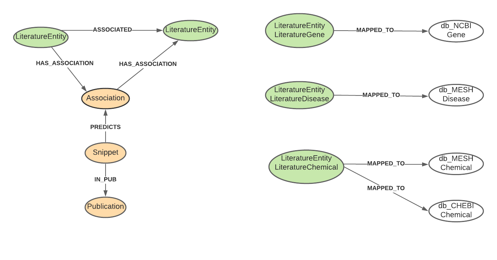

# Zenodo Literature Data Set

- paper: https://zenodo.org/record/3459420#.XfAH6JNKiBu
- download the files to folder $BASE_DATA_DIR/download/literature/. Make sure to get the latest version (Sept 24, 2019).   

Download all the part-i-*.txt.gz and part-ii-*-with-themes.txt.gz files
```bash
> cd graph-db/extraction/data/download/literature
> ./download.sh
```

## db_Literature Schema


The relationship 'PREDICTS' changed to 'INDICATES'

## Old parser link: 
https://github.com/SBRG/graphdb_prototypes/blob/master/src/loader/literature/literature_data_parser.py

The parser may need to update to reflect the new schema.
1. The old gene, chemical and disease only have one column for the id's. Since Literature data will be in separate domain in the new schema.  
Those files will need the following properties: [id, synonyms, id_source], where id need to remove the prefix (MESH, CHEBI etc) so that 
it would be easier to create the 'mapped_to' links. id', and the prefix can be stored as 'id_source'.
2. Since the literature sentence would use different names (as entry_text in INDICATES), 
you may need to set the name field later (after mapped to reference Gene, Chemical or Disease). I would suggest to put all the 'entry_text' into
'synonyms' property, and separate the terms using |.  
3. After literature data loaded (all nodes for db_Literature), use cypher to create the MAPPED_TO relationships, then based on the 
mapped entity, set literature entity name. If a literature entity could be mapped, choose the first term in the synonyms as its name.
4. Make sure to check the current database properties for Association and Snippet and INDICATES, and put the data into the correct output file.
The current parser output files were for the old data schema.
5. If you load data into a brand-new database, make sure to create constraints first (for snippet id, association id, LiteratureEntity id). 
Otherwise, the merge and relationships creation will be very very slow
6. snippet_id = pmid + sentence_num (refectoring query: SET n.id = p.pmid + '-' + n.sentence_num)
7. association_id = entry1_id + entry2_id + type  (refectoring query: SET a.id = n1.id + '-' + n2.id + '-' + a.type)
8. Don't forget to use eid instead of id

