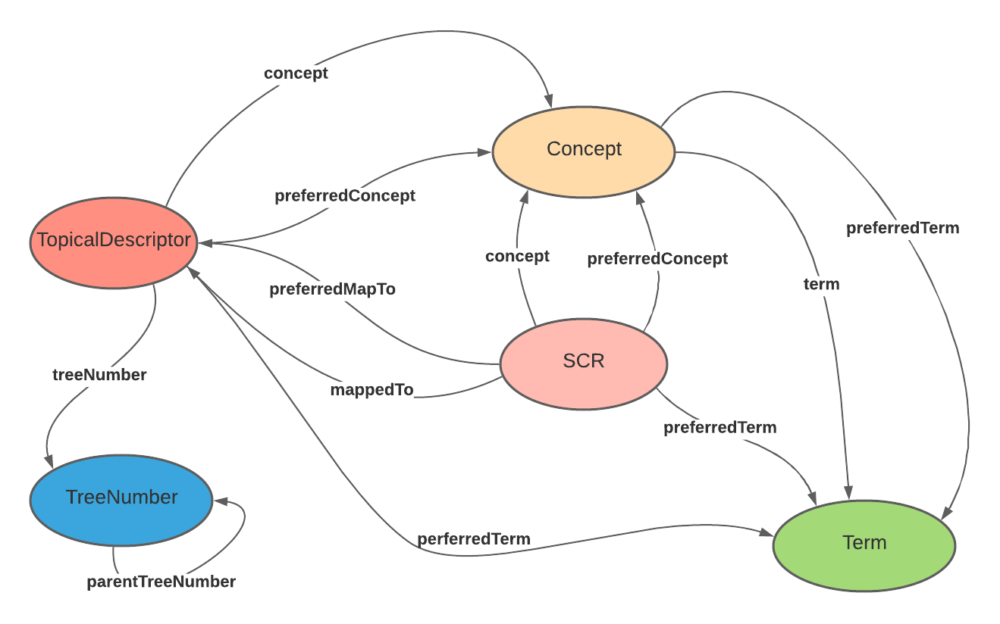

# MeSH Data Model (RDF imported database, not Lifelike)
### Descriptors 
https://hhs.github.io/meshrdf/descriptors   
MeSH headings, used to index citations in the NLM MEDLINE database and to describe the subjects for NLM Catalog 
records.  
Subclss of Descriptors:
- TopicalDescriptor
- PublicationType
- CheckTag
- GeographicalDescriptor

### Qualifiers 
A MeSH subheading, used to give additional context to a Descriptor.  
MeSH has rules governing which Qualifiers can be used with a given Descriptor, 
as well as which Qualifers cannot be used with a given Descriptor (pairs)

### Descriptor-Qualifier Pairs
https://hhs.github.io/meshrdf/descriptor-qualifier-pairs
- Qualifiers comprise a set of 83 terms used to add more specificity to descriptors.
- Each Descriptor has a set of Allowable Qualifiers
- Example:
    - Descriptor (D015242, Ofloxacin) and one of its Allowable Qualifiers (Q000008, administration & dosage)
   
### Supplementary Concept Records (SCR) 
https://hhs.github.io/meshrdf/scrs  
There are four sub-classes:
SCR_Chemical
SCR_Disease
SCR_Organism
SCR_Protocol
 
### Concepts
https://hhs.github.io/meshrdf/concepts   
A MeSH Concept represents a unit of meaning, all assigned ‘M’ identifiers.
- Each MeSH record consists of one or more Concepts
- Each Concept consists in one or more synonymous terms
- Collections of concepts are placed into MeSH Descriptor for topic search and retrieval

### Terms
https://hhs.github.io/meshrdf/terms   
A term is a human readable name used by a MeSH Concept.  
Within a MeSH concept, terms are strictly synonymous

### Tree Numbers
https://hhs.github.io/meshrdf/tree-numbers  
MeSH descriptors are organized into 16 categories, each of which is further divided into sub-categories to assist in more specific classification of a descriptor.  
- These hierarchical categories and subcategories are identified by MeSH tree numbers. 
- A given MeSH descriptor often has more than one tree number assigned to it, meaning that it fits into the category hierarchies in multiple places.    

Example: B03, B03.660, B03.660.075, B03.660.075.090.344

## Mesh Neo4j Graph Model (RDF imported graph)
