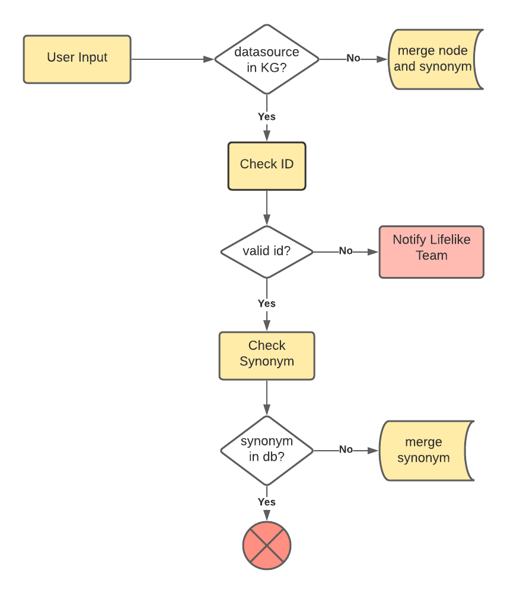

# Steps to add global inclusion terms in KG (LL-3237)
#### 1. create index: 
```
create index index_synonym_globalinslusion for (n:Synonym) on (n.global_inclusion)
```

#### 2. Add synonym to existing node
```
match (n:db_UniProt) where n.id = $external_id
merge (s:Synonym {name:row.name}) set s.global_inclusion=1
merge (n)-[r:HAS_SYNONYM]->(s) set r.inclusion_date = datetime(), r.user = $user
```
 
#### 3. Add new term and synonyms 
```
merge (n:db_Lifelike) where n.id = $external_id
on create set n:{EntityLabel}, n.name=$name, n.data_source=$datasource, n.external_id=$external_id,
n.hyperlink = $hyperlink, n.inclusion_date = datetime(), n.user = $user
with n
merge (s:Synonym {name:row.name}) set s.global_inclusion=1
merge (n)-[r:HAS_SYNONYM]->(s) set r.inclusion_date = datetime(), r.user = $user
```




