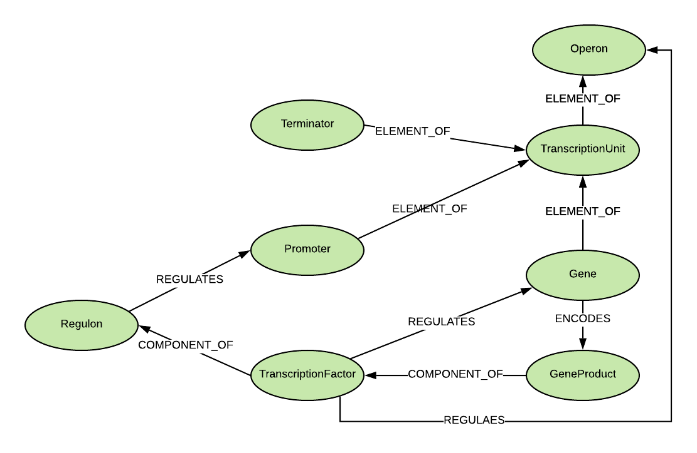

# RegulonDB

https://regulondb.ccg.unam.mx/   

RegulonDB is the primary database on transcriptional regulation in Escherichia coli K-12 containing knowledge
manually curated from original scientific publications, complemented with high throughput datasets and comprehensive 
computational predictions.

### Download site:
https://regulondb.ccg.unam.mx/central_panel_menu/downloads_menu.jsp   
Download the full text format file

### KG data model:

