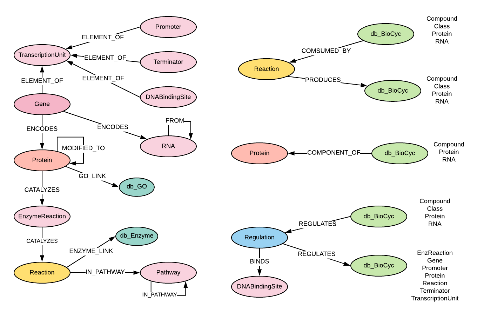

# BioCyc Spec for Knowledge Graph
The BioCyc database collection is an assortment of organism specific Pathway/ Genome Databases (PGDBs). They provide 
reference to genome and metabolic pathway information for thousands of organisms. 
Download site: https://brg-files.ai.sri.com/public/dist/.  Search for the specific organism data for download.

Currently we loaded the following databases:
- EcoCyc:  Escherichia coli K-12 substr. MG1655 (tax_id 511145)  
http://brg-files.ai.sri.com/public/dist/ecoli.tar.gz

- HumanCyc: Homo sapiens  (tax_id 9606)  
http://brg-files.ai.sri.com/public/dist/human.tar.gz

- YeastCyc: Saccharomyces cerevisiae S288C (tax_id 559292)   
http://brg-files.ai.sri.com/public/dist/yeastcyc.tar.gz

- PseudomonasCyc: for Pseudomonas putida KT2440 (tax_id 160488)  
http://brg-files.ai.sri.com/public/dist/pput160488cyc.tar.gz

- MetaCyc: MetaCyc is a curated database of experimentally elucidated metabolic pathways from all domains of life.
MetaCyc contains pathways involved in both primary and secondary metabolism, as well as associated metabolites, reactions, 
enzymes, and genes. The goal of MetaCyc is to catalog the universe of metabolism by storing a representative sample of each experimentally elucidated pathway 
https://brg-files.ai.sri.com/public/dist/meta.tar.gz

In Lifelike graph database, each node in BioCyc was labeled as db_BioCyc, and nodes for each biocyc database was 
labeled as additional database name, such as db_EcoCyc, db_HumanCyc.  Therefore for any EcoCyc, there are 3 labels: 
db_BioCyc, db_EcoCyc and the entity name (e.g. Gene, Protein)

### Graph database schema for BioCyc 


#### Node labels and attributes:   
id has the same value for biocyc_id, and displayName and pathways attributes were added post-loading for annotation

| Node Label | Attribute | Source |
|:-----|:-----------|:-|
| BioCycClass | biocyc_id | UNIQUE-ID |
| BioCycClass | data_source |"BioCyc" |
| BioCycClass | displayName | =coalesce(name, biocyc_id) |
| BioCycClass | id | =biocyc_id |
| BioCycClass | name | COMMON-NAME |
| BioCycClass | synonyms | SYNONYMS |
| Compound | abbrev_name | ABBREV-NAME |
| Compound | biocyc_id | UNIQUE-ID |
| Compound | data_source | "BioCyc" |	
| Compound | displayName | =coalesce(name, biocyc_id) |
| Compound | id |	=biocyc_id |
| Compound | inchi_key | INCHI-KEY<br />remove leading 'InChIKey='|
| Compound | name | COMMON-NAME<br />strip HTML tags and remove leading 'a ' and 'an ' |
| Compound | inchi | INCHI |
| Compound | smiles | SMILES |
| DNABindingSite | abs_center_pos | ABS-CENTER-POS |
| DNABindingSite | biocyc_id | UNIQUE-ID |
| DNABindingSite | data_source |"BioCyc" |
| DNABindingSite | description | |
| DNABindingSite | displayName | =protein displayName + ' BS' of proteins linked to the DNABindingSite through Regulation<br /><br /> else<br /><br /> =coalesce(name, biocyc_id)
| DNABindingSite | id | =biocyc_id |
| DNABindingSite | site_length | SITE-LENGTH |	
| EnzReaction | biocyc_id | UNIQUE-ID |
| EnzReaction | data_source |"BioCyc" |
| EnzReaction | description | |
| EnzReaction | displayName | = name + gene(s) that encodes the enzyme|
| EnzReaction | id | =biocyc_id |
| EnzReaction | name | COMMON-NAME |
| EnzReaction | synonyms | SYNONYMS |
| Gene | accession | ACCESSION-1 |
| Gene | biocyc_id | UNIQUE-ID |
| Gene | data_source |"BioCyc" |
| Gene | description | |
| Gene | displayName | =coalesce(name, biocyc_id) |
| Gene | id | =biocyc_id |
| Gene | left_end_position | LEFT-END-POSITION |
| Gene | name | COMMON-NAME |
| Gene | pathways | =set_gene_property_for_enrichment()|
| Gene | right_end_position | RIGHT-END-POSITION |
| Gene | strand | TRANSCRIPTION-DIRECTION |
| Gene | synonyms | SYNONYMS |
| Pathway | biocyc_id | UNIQUE-ID |
| Pathway | data_source |"BioCyc" |
| Pathway | displayName | =coalesce(name, biocyc_id) |
| Pathway | id | =biocyc_id |
| Pathway | name | COMMON-NAME |
| Pathway | synonyms | SYNONYMS |
| Promoter | biocyc_id | UNIQUE-ID |
| Promoter | data_source |"BioCyc" |
| Promoter | description | |
| Promoter | displayName | =coalesce(name, biocyc_id) |
| Promoter | id | =biocyc_id |
| Promoter | name | COMMON-NAME |
| Promoter | pos_1 | ABSOLUTE-PLUS-1-POS |	
| Promoter | strand | TRANSCRIPTION-DIRECTION |
| Promoter | synonyms | SYNONYMS |
| Protein | abbrev_name | ABBREV-NAME |
| Protein | biocyc_id | UNIQUE-ID |
| Protein | data_source |"BioCyc" |
| Protein | description | |	
| Protein | displayName | =coalesce(name, biocyc_id) |
| Protein | id | =biocyc_id |
| Protein | molecular_weight_kd | MOLECULAR-WEIGHT-KD |	
| Protein | name | COMMON-NAM |
| Protein | pi | PI |
| Protein | synonyms | SYNONYMS |
| Protein | location | LOCATIONS |
| Protein | GO | GO-TERMS |
| RNA | abbrev_name | ABBREV-NAME |
| RNA | biocyc_id | UNIQUE-ID |
| RNA | data_source |"BioCyc" |
| RNA | description | |
| RNA | displayName | =coalesce(name, biocyc_id) |
| RNA | id | =biocyc_id |
| RNA | location | LOCATIONS |
| RNA | name | COMMON-NAME
| Reaction | biocyc_id | UNIQUE-ID |
| Reaction | data_source |"BioCyc" |
| Reaction | description | |
| Reaction | displayName | =coalesce(ec_number, name, biocyc_id) |
| Reaction | ec_number | EC-NUMBER |
| Reaction | id | =biocyc_id |
| Reaction | name | COMMON-NAME |
| Reaction | other_name | SYSTEMATIC-NAME |
| Reaction | direction | REACTION-DIRECTION |
| Reaction | location | RXN-LOCATIONS |
| Reaction | synonyms | SYNONYMS |
| Regulation | biocyc_id | UNIQUE-ID |
| Regulation | data_source |"BioCyc" |
| Regulation | displayName | ? |
| Regulation | id | =biocyc_id |
| Regulation | mechanism | MECHANISM |
| Regulation | mode | MODE |
| Regulation | type | |
| Terminator | biocyc_id | UNIQUE-ID |
| Terminator | data_source |"BioCyc" |
| Terminator | displayName | =coalesce(name, biocyc_id) |
| Terminator | description | |
| Terminator | id | =biocyc_id |
| Terminator | left_end_position | LEFT-END-POSITION |
| Terminator | right_end_position | RIGHT-END-POSITION |
| TranscriptionUnit | biocyc_id | UNIQUE-ID |
| TranscriptionUnit | data_source |"BioCyc" |
| TranscriptionUnit | description |	|
| TranscriptionUnit | displayName | |
| TranscriptionUnit | id | =biocyc_id |
| TranscriptionUnit | name | COMMON-NAME |

#### Node outgoing relationships

| StartNode | Relationship | EndNode | Cardinality |   
|-----:|-----------:|-----:|-----------:|         
| Class | CHEBI_LINK | Chemical | 1 |	
| Class | COMPONENT_OF | Protein | + |	
| Class | CONSUMED_BY | Reaction | + |	
| Class | HAS_SYNONYM | Synonym | + |	
| Class | REGULATES | Regulation | + |	
| Class | TYPE_OF | Class | + |	
| Compound | CHEBI_LINK | Chemical | 1 |	
| Compound | COMPONENT_OF | Protein | + |	
| Compound | CONSUMED_BY | Reaction | + |	
| Compound | HAS_SYNONYM | Synonym | + |	
| Compound | REGULATES | Regulation | + |	
| Compound | TYPE_OF | Class | + |	
| DNABindingSite | ELEMENT_OF | TranscriptionUnit | 1 |	
| EnzReaction | CATALYZES | Reaction | 1 |	
| EnzReaction | HAS_SYNONYM | Synonym | + |	
| Gene | ELEMENT_OF | TranscriptionUnit | 1 |	
| Gene | ENCODES | Protein | 1 |	
| Gene | ENCODES | RNA | 1 |	
| Gene | HAS_SYNONYM | Synonym | + |	
| Gene | IS | db_NCBI Gene | 1 |	
| Pathway | HAS_SYNONYM | Synonym | + |	
| Pathway | IN_PATHWAY | Pathway | 1 |	
| Pathway | TYPE_OF | Class | + |	
| Promoter | ELEMENT_OF | TranscriptionUnit | 1 |	
| Promoter | HAS_SYNONYM | Synonym | + |	
| Protein | CATALYZES | EnzReaction | + |	
| Protein | COMPONENT_OF | Protein | + |	
| Protein | CONSUMED_BY | Reaction | + |	
| Protein | GO_LINK | db_GO | + |		
| Protein | HAS_SYNONYM | Synonym | + |	
| Protein | MODIFIED_TO | Protein | + |	
| Protein | REGULATES | Regulation | + |	
| Protein | TYPE_OF | Class | + |	
| RNA | COMPONENT_OF | Protein | + |	
| RNA | CONSUMED_BY | Reaction | + |	
| RNA | HAS_SYNONYM | Synonym | + |	
| RNA | MODIFIED_TO | RNA | + |	
| RNA | REGULATES | Regulation | + |	
| RNA | TYPE_OF | Class | + |	
| Reaction | ENZYME_LINK | EC_Number | + |	
| Reaction | HAS_SYNONYM | Synonym | + |	
| Reaction | IN_PATHWAY | Pathway | + |	
| Reaction | PRODUCES | Class | + |	
| Reaction | PRODUCES | Compound | + |	
| Reaction | PRODUCES | Protein | + |	
| Reaction | TYPE_OF | Class | + |	
| Regulation | BINDS | DNABindingSite | 1 |	
| Regulation | REGULATES | EnzReaction | 1 |	
| Regulation | REGULATES | Gene | 1 |	
| Regulation | REGULATES | Promoter | 1 |	
| Regulation | REGULATES | Protein | 1 |	
| Regulation | REGULATES | Reaction | 1 |	
| Regulation | REGULATES | Terminator | 1 |	
| Regulation | REGULATES | TranscriptionUnit | 1 |	
| Regulation | TYPE_OF | Class | + |	
| Terminator | ELEMENT_OF | TranscriptionUnit | 1 |	
| TranscriptionUnit | HAS_SYNONYM | Synonym | + |	


### Scripts to run after biocyc data updated
1. add protein synonyms for uniprot (see biocyc_protein_synonyms_for_uniprot.md)
2. set displayname and description
3. set data sources
```
match(n:db_BioCyc) set n.data_source='BioCyc'
```

### Set PseudomonasCyc genes as Master genes for Lifelike searching and annotations  
Since Pseudomonas putida KT2440 (taxID 160488) genes do not have NCBI gene links for now, we need to set Pseudomoas genes as Master gene.
Once NCBI integrated those genes, the steps can be removed  
- Follow the steps described in file 'Label_biocyc_genes_as_master.md' to update neo4j
- Generate LMDB annotation file if PseudomonasCyc updated, and handle to Binh.
```
src/biocyc/LMDB_annotation.generate_pseudomonas_genelist_for_LMDB
```


