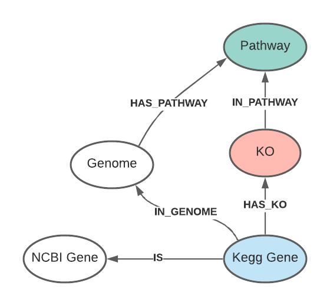

# KEGG Spec for Knowlege Graph

KEGG is an integrated database resource consisting of 18 main databases,
broadly categorized into systems information, genomic information, chemical
information, and health information. The database names and the corresponding
subdirectory names on this FTP site are as follows:

####  Systems information  
 - KEGG PATHWAY:  pathway, xml; KEGG pathway maps  
 - KEGG BRITE:         brite;      BRITE functional hierarchies
 - KEGG MODULE:          module;      KEGG modules
 #### Genomic information  
 - KEGG ORTHOLOGY (KO)   genes         KO functional orthologs
 -  KEGG GENOME           genes         KEGG organisms (complete genomes)
 -  KEGG GENES            genes         Gene catalogs of KEGG organisms
 -  KEGG SSDB                           GENES sequence similarity
 #### Chemical information  
 -  KEGG COMPOUND         ligand        Metabolites and other small molecules
 -  KEGG GLYCAN           ligand        Glycans
 -  KEGG REACTION         ligand        Biochemical reactions
 -  KEGG RCLASS           ligand        Reaction class
 - KEGG ENZYME           ligand        Enzyme nomenclature
 #### Health information  
 -  KEGG NETWORK          medicus       Disease-related network elements
 -  KEGG VARIANT          medicus       Human gene variants
 -  KEGG DISEASE          medicus       Human diseases
 -  KEGG DRUG             medicus       Drugs
 -  KEGG DGROUP           medicus       Drug groups
 -  KEGG ENVIRON          medicus       Crude drugs and health-related substances

## KEGG Pathway Maps

#### Pathway Types
    - metabolic
    - non-metabolic

#### Reference pathway map: 
    - linked to KO entries (K numbers)
    - linked to Enzyme entries (EC numbers)
    - linked to Reaction entries (R numbers)

#### Organism-specific map:
    - linked to GENES entries (gene ids)

## Download Data
KEGG database download is not free.  Check Vincenzo for license information.

url: ftp://ftp.kegg.net
#### Files needed for current KG:
- genes/ko/ko  (in ko.tar.gz)
- genes/genes_ncbi-geneid.list  (from genes/links/genes_ncbi-geneid.list.gz)
- pathway/pathway.list
- pathway/links/pathway_ko.list   (links.tar.gz)
- pathway/links/pathway_genome.list (links.tar.gz)

## KEGG KG Schema
The current kegg kg was used for annotation only. KEGG data has rich information about reactions,
enzymes and pathways and their assocations with diseases and drugs. Additional information could be loaded in the future.

